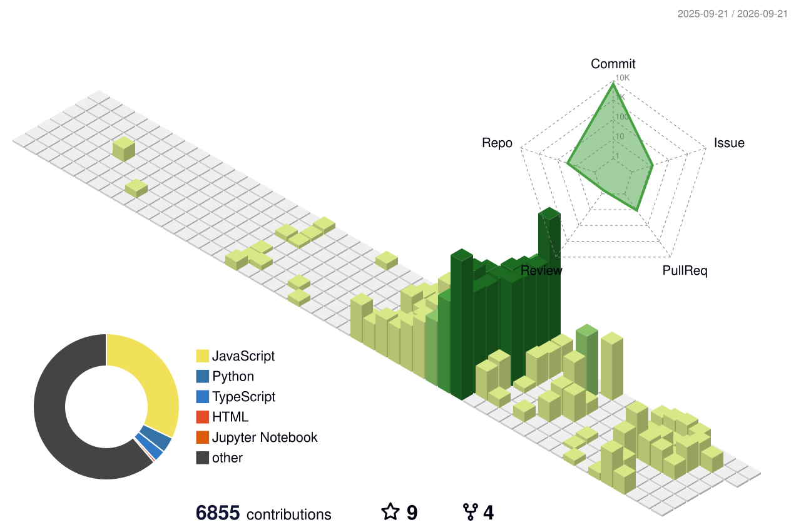

  

  

 

  
  
  

 

### 👨‍💻 About Me

* 🧠 **AI/ML Engineer** with a strong research background in Deep Learning, Computer Vision, and Explainable AI (XAI).
* 🔬 Currently a **Research Intern** at IIITDM Kurnool working on Medical Image Analysis (Chest X-Rays, Ocular Diseases, Oral Cancer).
* ⚙️ Experienced in deploying complex AI models onto edge devices like **Raspberry Pi** and building **IoT communication systems** using ESP32/STM32.
* 🏆 Secured Rs. 80,000 innovation funding through the PALS-QTPL Industry Innovation Program.
* 📚 Read my full professional background in my **[Detailed Resume](RESUME.md)**.

---

### 🛠️ Tech Stack & Arsenal

  

**Domains:** Deep Learning, Vision Transformers (ViT), Explainable AI (Grad-CAM, SHAP, LIME), Medical AI, Edge Deployment (TFLite), Embedded Systems, IoT (MQTT, NodeMCU).

---

### 📈 GitHub Analytics

  

 

  

 

  
  

 

  

---

  

