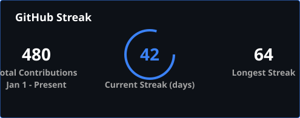
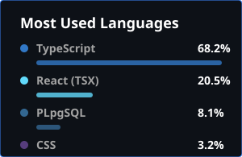

  

# Sreeram Jagadeeshwar

  
  
  
  

## 📌 Profile Summary

**AI/ML Engineer** with robust research experience in Deep Learning, Computer Vision, Explainable AI (XAI), Medical Image Analysis, and Edge AI Deployment. 

Currently working under the guidance of Dr. P. Ranga Babu (Associate Professor, IIITDM Kurnool) on sophisticated AI-driven healthcare systems involving chest X-ray disease classification, ocular disease diagnosis, and oral cancer detection. Experienced in developing end-to-end machine learning pipelines—from comprehensive data preprocessing and model architecture design to lightweight deployment on embedded and edge devices.

---

## 🎓 Education

**Bachelor of Technology (B.Tech) — Electronics and Communication Engineering**
*G. Pulla Reddy Engineering College, Kurnool* | Oct 2022 – Jun 2026
* **CGPA:** 8.23 / 10.0

---

## 💻 Technical Skills

| Category | Skills |
|:---|:---|
| **Programming Languages** | Python, C, MATLAB |
| **Machine Learning & AI** | TensorFlow, Keras, Scikit-Learn, Deep Learning, CNNs, Vision Transformers (ViT), Transfer Learning, Explainable AI, Medical Image Analysis |
| **Computer Vision** | OpenCV, Image Classification, Feature Extraction, Object Detection, Grad-CAM, SHAP, LIME, Attention Mechanisms (CBAM, SE, BAM) |
| **Deployment & Edge AI** | TensorFlow Lite, Flask, Raspberry Pi, Edge AI Deployment |
| **Embedded Systems & IoT** | STM32, ESP32, Arduino, MQTT, NodeMCU, Embedded Systems |
| **Tools & Environments** | Git, Linux, CubeMX, Proteus, Sentaurus TCAD |

---

## 🔬 Research Experience

**Research Intern – Medical AI & Computer Vision**
*Indian Institute of Information Technology Design and Manufacturing (IIITDM) Kurnool* | Jan 2025 – Jul 2025
*Guided by Dr. P. Ranga Babu, Associate Professor*

* **Chest X-Ray Disease Classification:** Developed a 4-class classification framework (COVID-19, Pneumonia, Tuberculosis, Normal) utilizing Wavelet Denoising, Xception architecture, and CBAM Attention. 
  * *Results:* Achieved 97.57% accuracy and a Macro F1-score of 0.9697, seamlessly optimizing the model for edge deployment on Raspberry Pi via TensorFlow Lite.
* **Explainable Ocular Disease Diagnosis:** Engineered an Explainable AI (XAI) framework for ocular disease classification utilizing EfficientNet-B3 integrated with Grad-CAM, SHAP, and LIME.
  * *Results:* Attained 91.6% accuracy while simultaneously generating clinically interpretable visual explanations to assist medical professionals.
* **Core Focus:** Medical image preprocessing, attention mechanisms, hyperparameter tuning, model optimization, explainability mapping, and edge AI orchestration.

---

## 📚 Publications

**IoT-Based Modular P10 LED Notice Board System for Real-Time Industrial Communication using MQTT and Flask**
*International Journal for Multidisciplinary Research (IJFMR) | Volume 8, Issue 2, March–April 2026*
* Co-Authors: P. Abdul Khayum, Sadhu Akash, P. Santhana Naik, J. Lingavardhan Reddy
* **Impact:** Designed and deployed a modular industrial communication system for QTPL using ESP8266, MQTT, Flask, and P10 displays.
* **Results:** Slashed deployment costs by >80% vs commercial signage and achieved sub-250ms message latency with >72 hours of uninterrupted stress-test operation.
* *DOI: [10.36948/IJFMR.2026.V08I02.74943](https://doi.org/10.36948/IJFMR.2026.V08I02.74943)*

---

## 🚀 Key Projects

### 🦷 Oral Cancer Detection using Deep Learning
* Architected classification pipelines leveraging VGG19, MobileNetV2, and state-of-the-art Vision Transformers (ViT).
* Integrated transfer learning, advanced hyperparameter optimization, and custom attention mechanisms.
* Validated clinical efficacy using ROC-AUC curves, F1-scores, confusion matrices, and Grad-CAM spatial visualizations.

### 🏭 PALS-QTPL Real-Time Digital Notice Board Using MQTT
* **Funding:** Secured **₹80,000 innovation grant** supported jointly by PALS, IIT Madras (IITM), and IIT Hyderabad (IITH).
* Spearheaded the embedded software and backend development of an ESP8266-based industrial comms platform.
* Successfully orchestrated live deployment in a harsh industrial environment, validating rigorous performance and latency metrics, culminating in a peer-reviewed journal publication.

### ✋ Gesture-Controlled Virtual Mouse Using Computer Vision
* Created a highly responsive touchless human-computer interaction (HCI) interface using OpenCV.
* Implemented real-time image processing arrays to accurately translate complex hand gestures into precise cursor movements and click events.

---

## 📜 Certifications & Continuous Learning

* **Microchip Embedded System Developer Certification**
* **Sentaurus TCAD Training** (ISWDP, LV1, LV2, Advanced)
* **NPTEL Certification:** Introduction to Internet of Things

---

## 🎖️ Leadership & Achievements

* **Secretary**, IEEE MTT-S Society (Managing technical seminars and workshops).
* **Innovator**, Secured ₹80,000 funding grant through the competitive PALS-QTPL Industry Innovation Program.
* **Global Finalist**, Selected for the prestigious IEEE YESIST International Project Showcase.
* **First Prize 🥇**, State Level Anokha Idea Presentation.
* **Second Prize 🥈**, "Recent Technologies: IoT and Its Uses" Symposium.
* **Top Performer 🌟**, NPTEL Introduction to IoT.

---
## 📈 GitHub Analytics

  

 

  

 

  
  

 

  

---

  <i>Open to opportunities in Machine Learning, Computer Vision, and Edge AI.</i>

